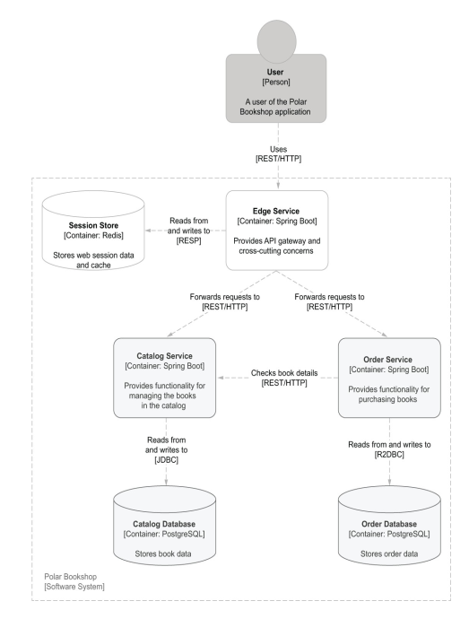
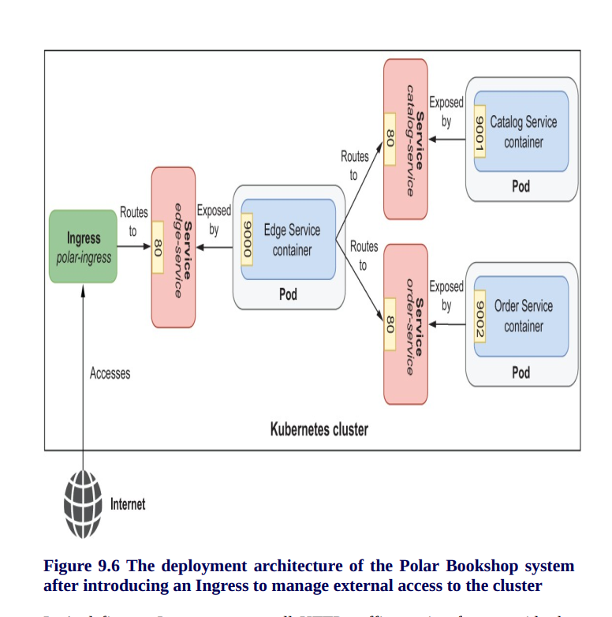

# Edge Service

This application is part of the Polar Bookshop system and provides an API gateway. It's part of the project
built in the [Cloud Native Spring in Action](https://www.manning.com/books/cloud-native-spring-in-action) book
by [Thomas Vitale](https://www.thomasvitale.com).

## Useful Commands

| Gradle Command	         | Description                                   |
|:---------------------------|:----------------------------------------------|
| `./gradlew bootRun`        | Run the application.                          |
| `./gradlew build`          | Build the application.                        |
| `./gradlew test`           | Run tests.                                    |
| `./gradlew bootJar`        | Package the application as a JAR.             |
| `./gradlew bootBuildImage` | Package the application as a container image. |

After building the application, you can also run it from the Java CLI:

```bash
java -jar build/libs/edge-service-0.0.1-SNAPSHOT.jar
```
# API Gateway and Circuit Breaker





# Security: Authentication and SPA


- **Authorization Server**—The entity responsible for authenticating users and issuing
tokens. In Polar Bookshop, this will be Keycloak.
- **User**—Also called the Resource Owner, this is the human logging in with the
Authorization Server to get authenticated access to the Client application. In
Polar Bookshop, it’s either a customer or an employee.
- **Client**—The application requiring the user to be authenticated. This can be a
mobile application, a browser-based application, a server-side application, or
even a smart TV application. In Polar Bookshop, it’s Edge Service.


# Security: Authorization and auditing


# Observability and monitoring


 ## Configuring health probes
- Liveness state — When an application is not live, 
this means it has entered a faulty internal state from which it won’t recover.
By default, Kubernetes will try restarting it to fix the problem.
- Readiness state — When an application is not ready,
this means it can’t process new requests, either because it’s still initializing all its components (during the
startup phase) or because it’s overloaded. Kubernetes will stop forwarding
requests to that instance until it’s ready to accept new requests again


## Distributed tracing with OpenTelemetry and Temp
- A simple way to solve that problem could be to generate an identifier for each
request at the edge of the system (a correlation ID), use it in event logs, and pass it over
to the other services involved. By using that correlation ID, 
we could fetch all log messages related to a particular transaction from multiple applications 
- There are three main concepts in distributed tracing:
  1. A trace represents the activities associated with a request or a transaction, identified uniquely by a trace ID. It’s composed of one or more spans across one or
     more services.
  2. Each step of the request processing is called a span, characterized by start and
     end timestamps and identified uniquely by the pair trace ID and span ID
  3. Tags are metadata that provide additional information regarding the span context, such as the request URI, the username of the currently logged-in user, or
     the tenant identifier.

## Application management and monitoring with Spring Boot Actuator
